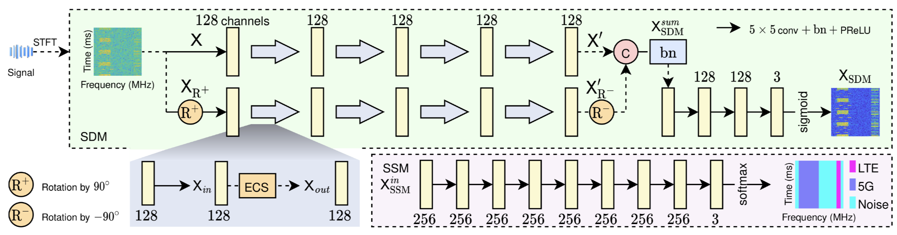
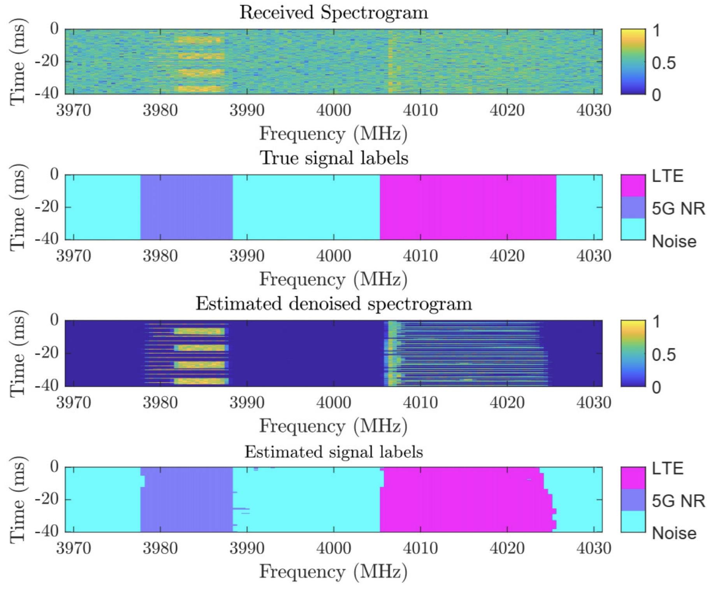

# D2SNet: A Denoising-to-Segmentation Network for Enhanced 5G-LTE Spectrum Awareness

Spectrum sensing is a technology that allows cognitive radio networks to identify unused portions of the radio spectrum. The goal is to enable secondary users to access these vacant frequency bands without causing interference to the primary (licensed) users. This capability is especially critical for future networks, which may implement spectrum sharing to allow technologies like 5G and LTE to operate in the same band for greater efficiency.

The main contribution of this paper is the proposal of D2SNet, a novel dual-task network architecture designed to address spectrum sensing in noisy environments. Its core contribution is a "denoising-to-segmentation" strategy, which validates that explicitly enhancing spectrogram quality before analysis is superior to end-to-end or direct-learning approaches. This superiority is driven by key technical advancements within its denoising module, namely a dual-branch rotational learning strategy to learn from multiple perspectives and an edge-center swapping (ECS) block to enhance boundary feature extraction. Through extensive experiments, D2SNet is shown to achieve state-of-the-art results in spectrogram segmentation, outperforming existing advanced models in segmentation accuracy while maintaining exceptional computational efficiency.

The Python code and dataset provided here are included in the version of the paper in IEEE Wireless Communications Letters.

Thien Huynh-The, Huu-Tai Nguyen, Thai-Hoc Vu, Daniel Benevides da Costa, and Quoc-Viet Pham, "D2SNet: A Denoising-to-Segmentation Network for Enhanced 5G-LTE Spectrum Awareness," in IEEE Wireless Communications Letters, doi: 10.1109/LWC.2025.3608332, 2025. [[Link](https://ieeexplore.ieee.org/abstract/document/11157776)]

The dataset can be downloaded from [Kaggle](https://www.kaggle.com/datasets/huutai23012003/spectrogramj04/data). Please report if it is not available.

If there are any errors or topics that need to be discussed, please contact [Huu-Tai Nguyen](https://github.com/HuuTaiNg) via email at n.huutai231@gmail.com.
